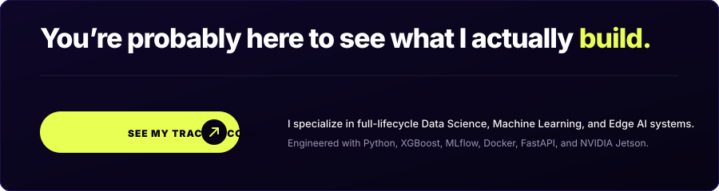
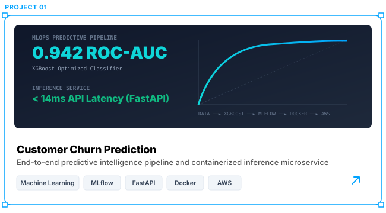
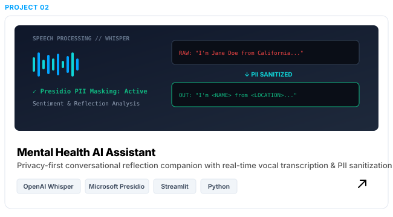
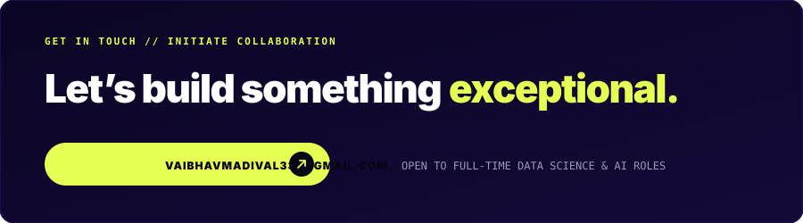

  <!-- ======================== RIO PROPERTY HERO BANNER ======================== -->
  

    

  <!-- DYNAMIC TYPING -->
  

    
  

   

  <!-- NAVIGATION PILLS -->
  

    
    &nbsp;&nbsp;
    
    &nbsp;&nbsp;
    
  

 

---

### ⚡ Overview

  

 

---

### 🚀 Done Deals // Featured Projects

 

<!-- PROJECT 1 CARD -->

  

 

<!-- PROJECT 2 CARD -->

  

 

<table>
  <!-- PROJECT 3 -->
  <tr>
    <td width="50%" valign="top">
      PROJECT 03 // EDGE AI
      <h3>🌱 AgriGita — Smart Water Management</h3>
      

        An IoT and Edge-AI agricultural platform built for automated soil telemetry and precision irrigation actuation.
      

      <ul>
        <li>On-device edge computation powered by the <b>NVIDIA Jetson Nano</b>.</li>
        <li>Continuous telemetry ingestion for soil moisture, humidity, and temperature.</li>
        <li>Automated algorithmic pump switching based on dynamic soil thresholds.</li>
        <li>Saves up to 40% irrigation water while preserving crop hydration.</li>
      </ul>
      

        <code>IoT Sensors</code> • <code>NVIDIA Jetson Nano</code> • <code>Python</code> • <code>Edge AI</code>
      

      

        🔗 <a href="https://github.com/vaibhavvm2005/agrigita-smart-water-management"><b>[Explore Repository ↗]</b></a>
      

    </td>
    <!-- PROJECT 4 -->
    <td width="50%" valign="top">
      PROJECT 04 // FULL-STACK
      <h3>⚡ Task Manager Pro</h3>
      

        A high-throughput productivity and task orchestrator platform built with the MERN stack for team workflow tracking.
      

      <ul>
        <li>Modular RESTful API endpoints for complete task lifecycle (CRUD) operations.</li>
        <li>Multi-criteria filtering, real-time search, and dynamic column sorting.</li>
        <li>Interactive dashboard charts detailing task completion velocity.</li>
        <li>Indexed query optimization and schema validation with MongoDB.</li>
      </ul>
      

        <code>MongoDB</code> • <code>Express.js</code> • <code>React.js</code> • <code>Node.js</code> • <code>REST APIs</code>
      

      

        🔗 <a href="https://github.com/vaibhavvm2005/task-manager-pro"><b>[Explore Repository ↗]</b></a>
      

    </td>
  </tr>
</table>

---

### 🧠 Capabilities // Services

<table>
  <tr>
    <td width="50%" valign="top">
      <h3>01 / PREDICTIVE MODELING</h3>
      

        Supervised classification, regression, customer churn modeling, and feature importance analysis using Scikit-learn and XGBoost.
      

      
<code>Scikit-learn</code> • <code>XGBoost</code> • <code>SHAP</code> • <code>Statistics</code>

    </td>
    <td width="50%" valign="top">
      <h3>02 / SPEECH AI &amp; NLP</h3>
      

        Multimodal acoustic speech-to-text with OpenAI Whisper and privacy-preserving PII masking with Microsoft Presidio.
      

      
<code>Whisper AI</code> • <code>Microsoft Presidio</code> • <code>NLP</code> • <code>Python</code>

    </td>
  </tr>
  <tr>
    <td width="50%" valign="top">
      <h3>03 / EDGE COMPUTING &amp; IOT</h3>
      

        Hardware-accelerated neural inference on the NVIDIA Jetson Nano to process live sensor telemetry and control physical relays.
      

      
<code>NVIDIA Jetson</code> • <code>IoT Telemetry</code> • <code>Hardware Control</code>

    </td>
    <td width="50%" valign="top">
      <h3>04 / MLOPS &amp; CLOUD DEPLOYMENT</h3>
      

        High-throughput asynchronous FastAPI microservices, MLflow experiment tracking, Docker containerization, and AWS hosting.
      

      
<code>FastAPI</code> • <code>MLflow</code> • <code>Docker</code> • <code>AWS</code>

    </td>
  </tr>
</table>

---

### ⚡ Technology Arsenal

  <code>PYTHON</code> &nbsp;•&nbsp;
  <code>SQL</code> &nbsp;•&nbsp;
  <code>C++</code> &nbsp;•&nbsp;
  <code>SCIKIT-LEARN</code> &nbsp;•&nbsp;
  <code>XGBOOST</code> &nbsp;•&nbsp;
  <code>PYTORCH</code> &nbsp;•&nbsp;
  <code>TENSORFLOW</code> &nbsp;•&nbsp;
  <code>FASTAPI</code> &nbsp;•&nbsp;
  <code>MLFLOW</code> &nbsp;•&nbsp;
  <code>DOCKER</code> &nbsp;•&nbsp;
  <code>AWS</code> &nbsp;•&nbsp;
  <code>PANDAS</code> &nbsp;•&nbsp;
  <code>NUMPY</code> &nbsp;•&nbsp;
  <code>MONGODB</code> &nbsp;•&nbsp;
  <code>NVIDIA JETSON</code>

---

### 📊 GitHub Radar // Activity

  <table border="0">
    <tr>
      <td align="center" width="50%">
        
      </td>
      <td align="center" width="50%">
        
      </td>
    </tr>
    <tr>
      <td align="center" colspan="2">
        
      </td>
    </tr>
  </table>

   

  <picture>
    <source media="(prefers-color-scheme: dark)" srcset="https://raw.githubusercontent.com/vaibhavvm2005/vaibhavvm2005/output/github-contribution-grid-snake-dark.svg">
    <source media="(prefers-color-scheme: light)" srcset="https://raw.githubusercontent.com/vaibhavvm2005/vaibhavvm2005/output/github-contribution-grid-snake.svg">
    
  </picture>

---

  <!-- ======================== RIO FOOTER CTA ======================== -->
  

    

  
  &nbsp;&nbsp;
  
  &nbsp;&nbsp;
  

    

  
<i>"Data Science • Machine Learning Engineering • Production Intelligence"</i>

