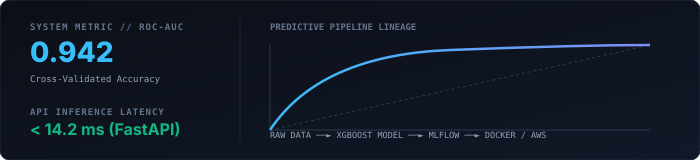
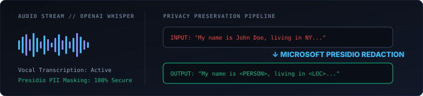

<div align="center">

  <!-- ======================== EDITORIAL HERO BANNER ======================== -->
  

  <br /><br />

  <!-- DYNAMIC TYPING -->
  <p align="center">
    <a href="https://github.com/vaibhavvm2005">
      
    </a>
  </p>

  <br />

  <!-- MINIMAL ACTION PILLS -->
  <p align="center">
    <a href="#01--selected-work">
      
    </a>
    &nbsp;&nbsp;&nbsp;
    <a href="#-contact">
      
    </a>
  </p>

</div>

<br />

---

### 📖 The Narrative // Story

<table>
  <tr>
    <td width="50%" valign="top">
      <h4>01 — STARTED WITH CODE</h4>
      <p>
        I began with programming out of curiosity for how logic translates into software. As I built my first applications, I became fascinated by how computing can solve tangible problems.
      </p>
      <h4>02 — DISCOVERED DATA</h4>
      <p>
        Working with exploratory data showed me that raw numbers conceal the deepest strategic answers. Learning to clean, model, and visualize data transformed how I approach engineering.
      </p>
    </td>
    <td width="50%" valign="top">
      <h4>03 — BUILT WITH AI</h4>
      <p>
        Stepping into machine learning and neural architectures bridged mathematics with predictive power. It allowed me to engineer systems that learn, generalize, and forecast.
      </p>
      <h4>04 — NOW</h4>
      <p>
        Today, I focus on building practical, end-to-end intelligent systems: from raw datasets and statistical validation to low-latency APIs and containerized cloud deployments.
      </p>
    </td>
  </tr>
</table>

---

### 🧩 Creative Code // The Intersection

```python
# The Intersection of Code, Data & Intelligence
dataset     =  ingest_data("telemetry_stream.sql")
pipeline    =  FeatureEngineering(scaling="standard", encoding="target")
model       =  XGBClassifier(n_estimators=500, learning_rate=0.03).fit(X_train, y_train)

# From Research Experimentation to Production API
prediction  =  model.predict(X_test)
app         =  FastAPI(title="Inference Microservice", version="2.0")
```

---

### 🧠 What I Build

<table>
  <tr>
    <td width="50%" valign="top">
      <h3>📊 DATA</h3>
      <p>
        I turn high-dimensional, unstructured datasets into meaningful statistical insights, feature distributions, and actionable decision pipelines.
      </p>
    </td>
    <td width="50%" valign="top">
      <h3>🤖 MACHINE LEARNING</h3>
      <p>
        I build, tune, and evaluate predictive architectures designed for real-world generalization, robust performance, and measurable business impact.
      </p>
    </td>
  </tr>
  <tr>
    <td width="50%" valign="top">
      <h3>🧠 AI APPLICATIONS</h3>
      <p>
        I engineer user-facing intelligent applications utilizing speech recognition, privacy-preserving PII masking, and IoT edge computation.
      </p>
    </td>
    <td width="50%" valign="top">
      <h3>⚙️ ENGINEERING &amp; MLOPS</h3>
      <p>
        I bridge the gap between notebook experiments and production environments through FastAPI microservices, Docker containers, and AWS deployments.
      </p>
    </td>
  </tr>
</table>

---

### 01 / Selected Work

<br />

#### 01 // CUSTOMER CHURN PREDICTION &amp; MLOPS

> **Classification:** `Machine Learning` • `MLOps` • `Cloud Deployment`

<div align="center">
  
</div>

<br />

An end-to-end predictive machine learning solution engineered to identify customer attrition risk with precision and operationalize model inference at scale.

- **Data Engineering:** Comprehensive exploratory data analysis, class imbalance handling, and automated feature encoding with Pandas.
- **Model Optimization:** Trained gradient-boosted decision trees using **XGBoost** with cross-validated ROC-AUC optimization.
- **Experiment Tracking:** Full parameter tuning, metrics logging, and artifact management tracked via **MLflow**.
- **Production Serving:** Low-latency prediction REST API built with **FastAPI**, containerized in **Docker**, and prepared for **AWS** cloud deployment.

```
STACK: Python • Pandas • Scikit-learn • XGBoost • MLflow • FastAPI • Docker • AWS
```

🔗 <a href="https://github.com/vaibhavvm2005/customer-churn-prediction"><b>[Explore GitHub Repository]</b></a>

<br /><br />

---

#### 02 // MENTAL HEALTH AI ASSISTANT

> **Classification:** `Artificial Intelligence` • `Speech Processing` • `Privacy Protection`

<div align="center">
  
</div>

<br />

A privacy-conscious conversational companion for audio reflection, sentiment journaling, and automated PII protection.

- **Audio Processing:** Real-time speech-to-text vocal transcription powered by **OpenAI Whisper**.
- **Privacy Sanitization:** Real-time Personally Identifiable Information (PII) detection and redaction using **Microsoft Presidio**.
- **Dialogue Engine:** Context-aware empathetic responses and longitudinal sentiment tracking.
- **User Interface:** Lightweight, accessible, and responsive frontend built in **Streamlit**.

```
STACK: Python • Whisper • Microsoft Presidio • Streamlit • NLP
```

🔗 <a href="https://github.com/vaibhavvm2005/mental-health-ai-assistant"><b>[Explore GitHub Repository]</b></a>

<br /><br />

---

#### 03 // AGRIGITA — SMART WATER MANAGEMENT SYSTEM

> **Classification:** `Edge AI` • `IoT` • `Smart Agriculture`

An intelligent IoT and Edge-AI agricultural framework that automates precision irrigation based on real-time soil telemetry.

- **Edge Intelligence:** On-device analytics and threshold evaluation executed on the **NVIDIA Jetson Nano**.
- **Continuous Telemetry:** Real-time soil moisture, humidity, and temperature monitoring via connected micro-sensors.
- **Automated Actuation:** Algorithmic relay switching for irrigation valves to eliminate agricultural water waste.
- **Conservation:** Delivers optimal crop hydration while reducing resource consumption.

```
STACK: IoT Sensors • NVIDIA Jetson Nano • Python • Embedded Systems
```

🔗 <a href="https://github.com/vaibhavvm2005/agrigita-smart-water-management"><b>[Explore GitHub Repository]</b></a>

<br /><br />

---

#### 04 // TASK MANAGER PRO

> **Classification:** `Full Stack Engineering` • `Web Application`

A full-stack productivity orchestrator built with the MERN architecture for high-velocity project workflow tracking.

- **RESTful Architecture:** High-throughput CRUD lifecycle endpoints built on Express.js and Node.js.
- **Data Discovery:** Real-time multi-criteria filtering, search, and dynamic column sorting algorithms.
- **Visual Analytics:** Dashboard metrics detailing task progress, priority distribution, and velocity.
- **Persistence:** Schema validation and indexed query optimization in MongoDB.

```
STACK: MongoDB • Express.js • React.js • Node.js • REST APIs
```

🔗 <a href="https://github.com/vaibhavvm2005/task-manager-pro"><b>[Explore GitHub Repository]</b></a>

<br />

---

### 📊 Where Data Meets Engineering

```
┌──────────────┐     ┌──────────────────────┐     ┌──────────────────┐     ┌──────────────────┐
│  01. DATA    │ ──► │ 02. STATS & ANALYSIS │ ──► │ 03. ML MODEL     │ ──► │ 04. FASTAPI REST │ ──► 05. CLOUD / AWS
│  [SQL / ETL] │     │ [Pandas / NumPy]     │     │ [XGBoost / DL]   │     │ [Docker Image]   │     [Real Impact]
└──────────────┘     └──────────────────────┘     └──────────────────┘     └──────────────────┘
```

---

### ⚡ Technology // Toolkit

<p align="center">
  <code>PYTHON</code> &nbsp;•&nbsp;
  <code>SQL</code> &nbsp;•&nbsp;
  <code>C++</code> &nbsp;•&nbsp;
  <code>PANDAS</code> &nbsp;•&nbsp;
  <code>NUMPY</code> &nbsp;•&nbsp;
  <code>SCIKIT-LEARN</code> &nbsp;•&nbsp;
  <code>XGBOOST</code> &nbsp;•&nbsp;
  <code>TENSORFLOW</code> &nbsp;•&nbsp;
  <code>PYTORCH</code> &nbsp;•&nbsp;
  <code>FASTAPI</code> &nbsp;•&nbsp;
  <code>MLFLOW</code> &nbsp;•&nbsp;
  <code>DOCKER</code> &nbsp;•&nbsp;
  <code>AWS</code> &nbsp;•&nbsp;
  <code>MYSQL</code> &nbsp;•&nbsp;
  <code>MONGODB</code> &nbsp;•&nbsp;
  <code>GIT</code>
</p>

---

### 📈 Activity // Radar

<div align="center">

  <table border="0">
    <tr>
      <td align="center" width="50%">
        
      </td>
      <td align="center" width="50%">
        
      </td>
    </tr>
    <tr>
      <td align="center" colspan="2">
        
      </td>
    </tr>
  </table>

  <br />

  <picture>
    <source media="(prefers-color-scheme: dark)" srcset="https://raw.githubusercontent.com/vaibhavvm2005/vaibhavvm2005/output/github-contribution-grid-snake-dark.svg">
    <source media="(prefers-color-scheme: light)" srcset="https://raw.githubusercontent.com/vaibhavvm2005/vaibhavvm2005/output/github-contribution-grid-snake.svg">
    
  </picture>

</div>

---

### 🧪 Currently Exploring

- 🧠 **Generative AI & LLMs:** RAG architectures, prompt orchestration, and transformer fine-tuning.
- ⚡ **Production MLOps:** Real-time drift detection, model evaluation loops, and feature stores.
- ☁️ **Cloud Data Engineering:** Distributed pipelines, high-dimensional vector search, and cloud-native microservices.

---

### 💼 Academic & Experience Background

```
2026
│
├── 🎓 B.E. Computer Science & Engineering (Data Science)
│   └── Alva's Institute of Engineering and Technology (AIET)
│       Focus: Statistical Inference, Algorithmic Design, Machine Learning
│
├── 🧠 Applied AI Engineering & Research Projects
│   └── Predictive Pipelines (XGBoost/MLflow) • Edge IoT (Jetson Nano) • Speech AI (Whisper)
│
└── 🚀 Industry Focus
    └── Building practical, scalable AI microservices and cloud deployments
```

---

<div align="center">

### 📬 Contact

<br />

```
HAVE AN IDEA?
LET'S BUILD SOMETHING USEFUL.
```

<br />

<a href="https://github.com/vaibhavvm2005" target="_blank">
  
</a>
&nbsp;&nbsp;
<a href="https://www.linkedin.com/in/vaibhav-madival" target="_blank">
  
</a>
&nbsp;&nbsp;
<a href="mailto:vaibhavmadival331@gmail.com" target="_blank">
  
</a>

<br /><br />

<p><i>"Code is the medium. Data is the foundation. Intelligence is the craft."</i></p>

</div>
