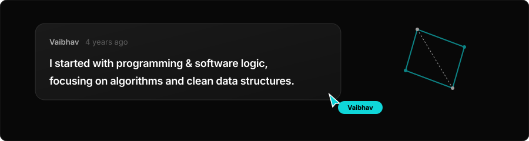
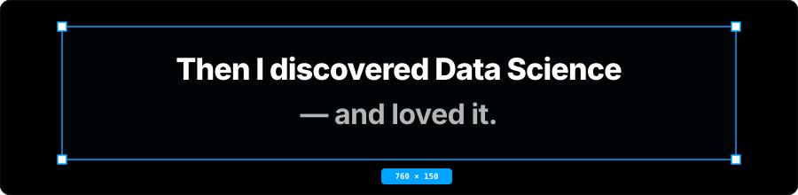
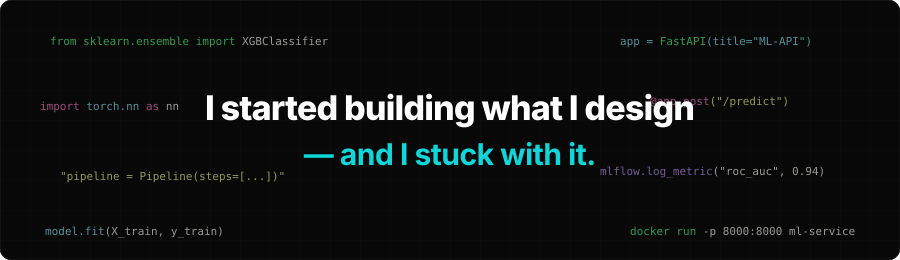

<div align="center">

  <!-- ======================== EMILIAN-INSPIRED HERO ======================== -->
  

  <br /><br />

  <!-- DYNAMIC TYPING -->
  <p align="center">
    <a href="https://github.com/vaibhavvm2005">
      
    </a>
  </p>

  <br />

  <!-- NAVIGATION PILLS -->
  <p align="center">
    <a href="#-selected-work">
      
    </a>
    &nbsp;&nbsp;
    <a href="#-contact">
      
    </a>
  </p>

</div>

<br />

---

### 📖 The Journey

<br />

<!-- STORY PHASE 1 -->
<div align="center">
  
</div>

<br />

<!-- STORY PHASE 2 -->
<div align="center">
  
</div>

<br />

<!-- STORY PHASE 3 -->
<div align="center">
  
</div>

<br />

---

### 🧠 What I Build

<table>
  <tr>
    <td width="50%" valign="top">
      <h3>01 / DATA</h3>
      <p>
        I transform complex, high-dimensional datasets into structured statistical insight, feature distributions, and actionable decision pipelines.
      </p>
    </td>
    <td width="50%" valign="top">
      <h3>02 / MACHINE LEARNING</h3>
      <p>
        I design, evaluate, and fine-tune predictive models with Scikit-learn and XGBoost, engineered for real-world reliability and generalization.
      </p>
    </td>
  </tr>
  <tr>
    <td width="50%" valign="top">
      <h3>03 / AI APPLICATIONS</h3>
      <p>
        I build intelligent user-facing systems with speech recognition (Whisper), privacy-preserving PII redaction (Presidio), and edge intelligence.
      </p>
    </td>
    <td width="50%" valign="top">
      <h3>04 / ENGINEERING &amp; MLOPS</h3>
      <p>
        I turn machine learning models into high-throughput FastAPI REST microservices, containerized with Docker, and deployed on AWS.
      </p>
    </td>
  </tr>
</table>

---

### 🚀 Selected Work

<br />

<!-- PROJECT 1 CARD -->
<div align="center">
  <a href="https://github.com/vaibhavvm2005/customer-churn-prediction">
    
  </a>
</div>

<br />

<!-- PROJECT 2 CARD -->
<div align="center">
  <a href="https://github.com/vaibhavvm2005/mental-health-ai-assistant">
    
  </a>
</div>

<br />

<table>
  <!-- PROJECT 3 -->
  <tr>
    <td width="50%" valign="top">
      <span style="color: #00A3FF; font-weight: 700; font-size: 11px;">PROJECT 03</span>
      <h3>🌱 AgriGita — Smart Water Management</h3>
      <p>
        An IoT and Edge-AI agricultural platform built for automated soil telemetry and precision irrigation actuation.
      </p>
      <ul>
        <li>On-device edge computation powered by the <b>NVIDIA Jetson Nano</b>.</li>
        <li>Continuous telemetry ingestion for soil moisture, humidity, and temperature.</li>
        <li>Automated algorithmic pump switching based on dynamic soil thresholds.</li>
        <li>Significantly reduces water consumption while maintaining crop hydration.</li>
      </ul>
      <p>
        <code>IoT Sensors</code> • <code>NVIDIA Jetson Nano</code> • <code>Python</code> • <code>Edge AI</code>
      </p>
      <p>
        🔗 <a href="https://github.com/vaibhavvm2005/agrigita-smart-water-management"><b>[Explore Repository]</b></a>
      </p>
    </td>
    <!-- PROJECT 4 -->
    <td width="50%" valign="top">
      <span style="color: #00A3FF; font-weight: 700; font-size: 11px;">PROJECT 04</span>
      <h3>⚡ Task Manager Pro</h3>
      <p>
        A full-stack productivity and task management platform built with the MERN stack for high-throughput project workflow tracking.
      </p>
      <ul>
        <li>Modular RESTful API endpoints for complete task lifecycle (CRUD) operations.</li>
        <li>Multi-criteria filtering, real-time search, and dynamic column sorting.</li>
        <li>Interactive dashboard charts detailing task completion metrics and velocity.</li>
        <li>Schema validation and indexed query optimization with MongoDB.</li>
      </ul>
      <p>
        <code>MongoDB</code> • <code>Express.js</code> • <code>React.js</code> • <code>Node.js</code> • <code>REST APIs</code>
      </p>
      <p>
        🔗 <a href="https://github.com/vaibhavvm2005/task-manager-pro"><b>[Explore Repository]</b></a>
      </p>
    </td>
  </tr>
</table>

---

### 📊 Where Data Meets Engineering

```
┌──────────────┐     ┌──────────────────────┐     ┌──────────────────┐     ┌──────────────────┐
│  01. DATA    │ ──► │ 02. STATS & ANALYSIS │ ──► │ 03. ML MODEL     │ ──► │ 04. FASTAPI REST │ ──► 05. CLOUD / AWS
│  [SQL / ETL] │     │ [Pandas / NumPy]     │     │ [XGBoost / DL]   │     │ [Docker Image]   │     [Real Impact]
└──────────────┘     └──────────────────────┘     └──────────────────┘     └──────────────────┘
```

---

### ⚡ Technology // Toolkit

<p align="center">
  <code>PYTHON</code> &nbsp;•&nbsp;
  <code>SQL</code> &nbsp;•&nbsp;
  <code>C++</code> &nbsp;•&nbsp;
  <code>PANDAS</code> &nbsp;•&nbsp;
  <code>NUMPY</code> &nbsp;•&nbsp;
  <code>SCIKIT-LEARN</code> &nbsp;•&nbsp;
  <code>XGBOOST</code> &nbsp;•&nbsp;
  <code>TENSORFLOW</code> &nbsp;•&nbsp;
  <code>PYTORCH</code> &nbsp;•&nbsp;
  <code>FASTAPI</code> &nbsp;•&nbsp;
  <code>MLFLOW</code> &nbsp;•&nbsp;
  <code>DOCKER</code> &nbsp;•&nbsp;
  <code>AWS</code> &nbsp;•&nbsp;
  <code>MYSQL</code> &nbsp;•&nbsp;
  <code>MONGODB</code> &nbsp;•&nbsp;
  <code>GIT</code>
</p>

---

### 📈 Activity // Radar

<div align="center">

  <table border="0">
    <tr>
      <td align="center" width="50%">
        
      </td>
      <td align="center" width="50%">
        
      </td>
    </tr>
    <tr>
      <td align="center" colspan="2">
        
      </td>
    </tr>
  </table>

  <br />

  <picture>
    <source media="(prefers-color-scheme: dark)" srcset="https://raw.githubusercontent.com/vaibhavvm2005/vaibhavvm2005/output/github-contribution-grid-snake-dark.svg">
    <source media="(prefers-color-scheme: light)" srcset="https://raw.githubusercontent.com/vaibhavvm2005/vaibhavvm2005/output/github-contribution-grid-snake.svg">
    
  </picture>

</div>

---

### 🧪 Currently Exploring

- 🧠 **Generative AI & LLMs:** RAG architectures, prompt engineering, and transformer fine-tuning.
- ⚡ **Production MLOps:** Real-time drift detection, model evaluation loops, and feature stores.
- ☁️ **Cloud Data Engineering:** Distributed pipelines, vector search, and cloud-native microservices.

---

### 💼 Academic & Experience Background

```
2026
│
├── 🎓 B.E. Computer Science & Engineering (Data Science)
│   └── Alva's Institute of Engineering and Technology (AIET)
│       Focus: Statistical Inference, Algorithmic Design, Machine Learning
│
├── 🧠 Applied AI Engineering & Research Projects
│   └── Predictive Pipelines (XGBoost/MLflow) • Edge IoT (Jetson Nano) • Speech AI (Whisper)
│
└── 🚀 Industry Focus
    └── Building practical, scalable AI microservices and cloud deployments
```

---

<div align="center">

  <!-- ======================== FOOTER CTA ======================== -->
  

  <br /><br />

  <a href="https://github.com/vaibhavvm2005" target="_blank">
    
  </a>
  &nbsp;&nbsp;
  <a href="https://www.linkedin.com/in/vaibhav-madival" target="_blank">
    
  </a>
  &nbsp;&nbsp;
  <a href="mailto:vaibhavmadival331@gmail.com" target="_blank">
    
  </a>

  <br /><br />

  <p><i>"Design meets code. Data meets intelligence."</i></p>

</div>
