<div align="center">

  <!-- HERO BANNER -->
  

  <br />

  <!-- DYNAMIC TYPING -->
  <p align="center">
    <a href="https://github.com/vaibhavvm2005">
      
    </a>
  </p>

  <!-- SHORT INTRO -->
  <p align="center">
    I am a <b>Data Science &amp; AI/ML Engineer</b> passionate about turning complex datasets into robust predictive models, scalable APIs, and production systems.
  </p>

  <!-- ACTION BUTTONS -->
  <p align="center">
    <a href="#-featured-projects">
      
    </a>
    &nbsp;&nbsp;
    <a href="#-connect">
      
    </a>
  </p>

</div>

---

### 👨‍💻 About Me

<table>
  <tr>
    <td width="58%" valign="top">
      <p>
        I specialize in <b>Data Science, Machine Learning, and Software Engineering</b>. My work is focused on creating practical, production-ready AI solutions rather than keeping models confined to notebooks.
      </p>
      <p>
        From exploratory data analysis and statistical modeling to building low-latency <b>FastAPI</b> inference microservices, containerizing with <b>Docker</b>, and deploying on <b>AWS</b>, I enjoy owning the entire intelligence lifecycle.
      </p>
      <p>
        🎓 Pursuing <b>B.E. in Computer Science &amp; Engineering (Data Science)</b> at <b>Alva's Institute of Engineering and Technology</b>.
      </p>
    </td>
    <td width="42%" valign="top">
      <b>Quick Overview</b>
      <ul>
        <li><b>Focus:</b> Data Science • AI/ML • Systems</li>
        <li><b>Languages:</b> Python • C++ • SQL</li>
        <li><b>Building:</b> Predictive ML • APIs • Data Apps</li>
        <li><b>Learning:</b> MLOps • Generative AI • Cloud</li>
        <li><b>Location:</b> India</li>
      </ul>
    </td>
  </tr>
</table>

---

### ⚡ Tech Stack

<div align="center">

<table>
  <tr>
    <td width="50%" valign="top">
      <b>Languages</b><br />
      
      
      
    </td>
    <td width="50%" valign="top">
      <b>Data Science &amp; Analytics</b><br />
      
      
      
      
      
    </td>
  </tr>
  <tr>
    <td width="50%" valign="top">
      <b>Machine Learning</b><br />
      
      
    </td>
    <td width="50%" valign="top">
      <b>Deep Learning</b><br />
      
      
      
    </td>
  </tr>
  <tr>
    <td width="50%" valign="top">
      <b>Backend &amp; Databases</b><br />
      
      
      
      
    </td>
    <td width="50%" valign="top">
      <b>Cloud, DevOps &amp; MLOps</b><br />
      
      
      
    </td>
  </tr>
  <tr>
    <td colspan="2" align="center">
      <b>Developer Environment &amp; Tools</b><br />
      
      
      
      
      
    </td>
  </tr>
</table>

</div>

---

### 🚀 Featured Projects

<table>
  <!-- PROJECT 1 -->
  <tr>
    <td width="50%" valign="top">
      <h4>📊 Customer Churn Prediction &amp; MLOps Pipeline</h4>
      <p>
        An end-to-end predictive machine learning system that forecasts customer churn risk and exposes real-time inferences through a containerized REST API.
      </p>
      <b>Key Features:</b>
      <ul>
        <li>Exploratory data analysis, handling class imbalance, and feature encoding with Pandas &amp; Scikit-learn.</li>
        <li>Gradient boosting classifier trained using <b>XGBoost</b> with cross-validated ROC-AUC optimization.</li>
        <li>Experiment tracking, metrics logging, and artifact management with <b>MLflow</b>.</li>
        <li>Low-latency prediction endpoint built with <b>FastAPI</b>.</li>
        <li>Containerized with <b>Docker</b> for scalable deployment on <b>AWS</b>.</li>
      </ul>
      <p>
        
        
        
        
        
        
      </p>
      <p>
        🔗 <a href="https://github.com/vaibhavvm2005/customer-churn-prediction"><b>[Explore Repository]</b></a>
      </p>
    </td>
    <!-- PROJECT 2 -->
    <td width="50%" valign="top">
      <h4>🧠 Mental Health AI Assistant</h4>
      <p>
        A privacy-conscious conversational assistant for vocal reflections, audio sentiment journaling, and automated PII protection.
      </p>
      <b>Key Features:</b>
      <ul>
        <li>Speech-to-text audio transcription powered by <b>OpenAI Whisper</b>.</li>
        <li>Automated detection and redaction of Personally Identifiable Information (PII) using <b>Microsoft Presidio</b>.</li>
        <li>Empathetic conversational response generation and sentiment tracking.</li>
        <li>Lightweight, accessible user interface built with <b>Streamlit</b>.</li>
      </ul>
      <p>
        
        
        
        
      </p>
      <p>
        🔗 <a href="https://github.com/vaibhavvm2005/mental-health-ai-assistant"><b>[Explore Repository]</b></a>
      </p>
    </td>
  </tr>
  <!-- PROJECT 3 -->
  <tr>
    <td width="50%" valign="top">
      <h4>🌱 AgriGita — Smart Water Management</h4>
      <p>
        An IoT and Edge-AI precision agricultural framework designed for automated soil monitoring and efficient irrigation actuation.
      </p>
      <b>Key Features:</b>
      <ul>
        <li>On-device edge computation powered by the <b>NVIDIA Jetson Nano</b>.</li>
        <li>Continuous telemetry ingestion for soil moisture, humidity, and temperature.</li>
        <li>Automated algorithmic pump switching based on dynamic soil thresholds.</li>
        <li>Significantly reduces water consumption while maintaining optimal soil hydration.</li>
      </ul>
      <p>
        
        
        
      </p>
      <p>
        🔗 <a href="https://github.com/vaibhavvm2005/agrigita-smart-water-management"><b>[Explore Repository]</b></a>
      </p>
    </td>
    <!-- PROJECT 4 -->
    <td width="50%" valign="top">
      <h4>⚡ Task Manager Pro</h4>
      <p>
        A full-stack productivity and task management web application built with the MERN stack for team workflow tracking.
      </p>
      <b>Key Features:</b>
      <ul>
        <li>Modular RESTful API endpoints for complete task lifecycle (CRUD) operations.</li>
        <li>Multi-criteria filtering, real-time search, and dynamic sorting functionality.</li>
        <li>Interactive dashboard charts detailing task completion metrics and priority distribution.</li>
        <li>Schema validation and indexed query optimization in MongoDB.</li>
      </ul>
      <p>
        
        
        
        
      </p>
      <p>
        🔗 <a href="https://github.com/vaibhavvm2005/task-manager-pro"><b>[Explore Repository]</b></a>
      </p>
    </td>
  </tr>
</table>

---

### 📊 GitHub Activity

<div align="center">

  <table border="0">
    <tr>
      <td align="center" width="50%">
        
      </td>
      <td align="center" width="50%">
        
      </td>
    </tr>
    <tr>
      <td align="center" colspan="2">
        
      </td>
    </tr>
  </table>

</div>

---

### 🐍 Contribution Activity

<div align="center">

  <picture>
    <source media="(prefers-color-scheme: dark)" srcset="https://raw.githubusercontent.com/vaibhavvm2005/vaibhavvm2005/output/github-contribution-grid-snake-dark.svg">
    <source media="(prefers-color-scheme: light)" srcset="https://raw.githubusercontent.com/vaibhavvm2005/vaibhavvm2005/output/github-contribution-grid-snake.svg">
    
  </picture>

</div>

---

### 📈 Currently Exploring

- 🧠 **Generative AI & LLM Systems:** Prompt engineering, fine-tuning, and RAG architectures.
- ⚡ **Production MLOps:** Continuous model monitoring, drift detection, and automated retraining pipelines.
- ☁️ **Cloud Data Engineering:** Scalable data pipelines, vector search, and cloud-native model deployment.

---

### 💼 Experience & Education

```
2026
│
├── 🎓 B.E. Computer Science & Engineering (Data Science)
│   └── Alva's Institute of Engineering and Technology (AIET)
│       Specialization in Data Structures, Statistical Analysis & Machine Learning
│
├── 🧠 Applied AI & Machine Learning Projects
│   └── Built End-to-End Predictive Pipelines (XGBoost/MLflow) & Edge AI Systems (Jetson Nano)
│
└── 🛠️ Technical Growth & Practical Applications
    └── Focus on Production MLOps, Containerization (Docker), and Cloud APIs (FastAPI/AWS)
```

---

### 🏆 Achievements & Certifications

- 📜 **Machine Learning & Data Science** — *[Add Credential / Issuing Organization]*
- 📜 **Deep Learning & Neural Networks** — *[Add Credential / Issuing Organization]*
- 📜 **Cloud & DevOps Fundamentals** — *[Add Credential / Issuing Organization]*
- 🏆 **Hackathons & Coding Challenges** — *[Add Details / Ranks]*

*(Note: Replace placeholders with your verified credentials or link your badge URLs.)*

---

### 📬 Connect

<div align="center">

  <a href="https://github.com/vaibhavvm2005" target="_blank">
    
  </a>
  &nbsp;&nbsp;
  <a href="https://www.linkedin.com/in/vaibhav-madival" target="_blank">
    
  </a>
  &nbsp;&nbsp;
  <a href="mailto:vaibhavmadival331@gmail.com" target="_blank">
    
  </a>

  <br /><br />
  <p><i>"Always learning. Always building."</i></p>

</div>
