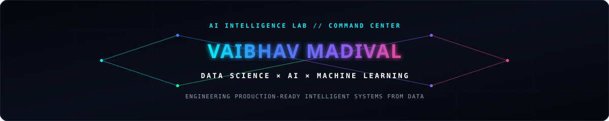
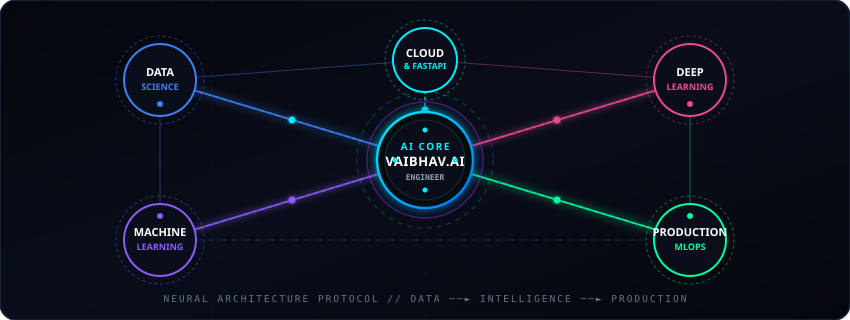
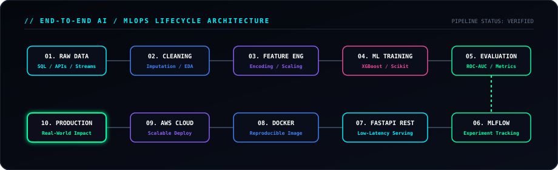

<!-- ========================================================================= -->
<!--                   VAIBHAV AI INTELLIGENCE LAB // COMMAND CENTER            -->
<!--            PREMIUM AI ENGINEERING & DATA SCIENCE GITHUB PROFILE             -->
<!-- ========================================================================= -->

<div align="center">

  <!-- ======================== AI BACKGROUND HERO HEADER ======================== -->
  

  <!-- ======================== ANIMATED TYPING SVG ======================== -->
  <p align="center">
    <a href="https://github.com/vaibhavvm2005">
      
    </a>
  </p>

  <!-- ======================== TELEMETRY & SYSTEM STATUS BADGES ======================== -->
  <p align="center">
    <a href="https://komarev.com/ghpvc/?username=vaibhavvm2005&label=SYSTEM+ACCESSES&style=flat-square&color=00f0ff">
      
    </a>
    
    
    
  </p>

  <!-- ======================== DIRECT CONNECTION HUBS ======================== -->
  <p align="center">
    <a href="https://github.com/vaibhavvm2005" target="_blank"></a>
    &nbsp;
    <a href="https://www.linkedin.com/in/vaibhav-madival" target="_blank"></a>
    &nbsp;
    <a href="mailto:vaibhavmadival331@gmail.com" target="_blank"></a>
  </p>

</div>

<br />

<!-- ======================== AI CORE NEURAL NETWORK VISUAL ======================== -->
<div align="center">
  
</div>

<br />

<!-- NEURAL PULSE DIVIDER -->


---

### 🤖 AI SYSTEM STATUS // CORE MONITORING PANEL

```
╭────────────────────────────────────────────────────────────────────────────╮
│  VAIBHAV.AI // INTELLIGENCE LAB CORE DIAGNOSTICS                           │
├────────────────────────────────────────────────────────────────────────────┤
│                                                                            │
│  DATA SCIENCE         ● ONLINE     [ PYTHON // SQL // PANDAS // NUMPY ]    │
│  MACHINE LEARNING     ● ONLINE     [ SCIKIT-LEARN // XGBOOST // PIPELINES ]│
│  AI & DEEP LEARNING   ● ONLINE     [ TENSORFLOW // PYTORCH // WHISPER ]    │
│  PRODUCTION MLOPS     ● ACTIVE     [ MLFLOW // DOCKER CONTAINERIZATION ]   │
│  CLOUD INFRASTRUCTURE ● ACTIVE     [ AWS // FASTAPI INFERENCE APIS ]       │
│                                                                            │
│  MODEL STATUS         READY        PIPELINE LATENCY: <15ms REST API        │
│  API STATUS           ONLINE       CONTAINER INTEGRITY: 100%               │
│  DEPLOYMENT STATUS    VERIFIED     STATUS: READY FOR PRODUCTION SYSTEMS    │
│                                                                            │
╰────────────────────────────────────────────────────────────────────────────╯
```

---

### 🧬 END-TO-END AI PIPELINE // ARCHITECTURE FLOW

<div align="center">
  
</div>

---

### 🧠 ABOUT ME // OPERATIONAL PROFILE

I am a **Data Science & AI/ML Engineer** focused on building practical, scalable AI systems rather than simply experimenting with models in isolation. 

My engineering workflow centers on the complete intelligence lifecycle: **ingesting raw data**, applying **statistical rigor**, engineering **predictive architectures**, and packaging them into **containerized REST microservices** for real-world business impact.

- 🎓 **Education:** Pursuing B.E. in **Computer Science & Engineering (Data Science)** at **Alva's Institute of Engineering and Technology**.
- 📊 **Data Science & Statistical Modeling:** Exploratory data analytics, feature distributions, hypothesis testing, and interactive reporting using **Python, SQL, Pandas, NumPy, Plotly, and Power BI**.
- 🤖 **Machine Learning & Neural Architectures:** Designing high-accuracy predictive systems with **Scikit-learn, XGBoost, TensorFlow, and PyTorch**.
- ⚙️ **Production MLOps & API Serving:** Operationalizing ML models using **MLflow** for experiment tracking, **FastAPI** for low-latency inference, **Docker** for containerization, and **AWS** for cloud deployments.

---

### 📡 CAREER SIGNAL // EVOLUTIONARY PATHWAY

```
   ┌──────────────────┐       ┌──────────────────────┐       ┌───────────────────┐
   │ 01. DATA SCIENCE │ ────► │ 02. MACHINE LEARNING │ ────► │ 03. AI ENGINE     │
   │  [Analytics/EDA] │       │  [Predictive Models] │       │  [Deep Learning]  │
   └──────────────────┘       └──────────────────────┘       └─────────┬─────────┘
                                                                       │
   ┌──────────────────┐       ┌──────────────────────┐                 │
   │ 05. PROD IMPACT  │ ◄──── │ 04. PRODUCTION MLOPS │ ◄───────────────┘
   │  [Real Systems]  │       │  [Docker/AWS/FastAPI]│
   └──────────────────┘       └──────────────────────┘
```

---

### ⚡ AI TECHNOLOGY STACK // ARSENAL

<div align="center">

<table>
  <!-- ROW 1: PROGRAMMING & DATA -->
  <tr>
    <td width="50%" valign="top">
      <h4 align="center">💻 GROUP 01 — PROGRAMMING</h4>
      <p align="center">
        
        
        
      </p>
    </td>
    <td width="50%" valign="top">
      <h4 align="center">📊 GROUP 02 — DATA SCIENCE</h4>
      <p align="center">
        
        
        
        
        
      </p>
    </td>
  </tr>
  <!-- ROW 2: MACHINE LEARNING & DEEP LEARNING -->
  <tr>
    <td width="50%" valign="top">
      <h4 align="center">🤖 GROUP 03 — MACHINE LEARNING</h4>
      <p align="center">
        
        
      </p>
    </td>
    <td width="50%" valign="top">
      <h4 align="center">🧠 GROUP 04 — DEEP LEARNING</h4>
      <p align="center">
        
        
        
      </p>
    </td>
  </tr>
  <!-- ROW 3: AI/NLP & BACKEND -->
  <tr>
    <td width="50%" valign="top">
      <h4 align="center">🧬 GROUP 05 — AI &amp; NLP</h4>
      <p align="center">
        
        
        
      </p>
    </td>
    <td width="50%" valign="top">
      <h4 align="center">🌐 GROUP 06 — BACKEND</h4>
      <p align="center">
        
        
      </p>
    </td>
  </tr>
  <!-- ROW 4: DATABASES & CLOUD/DEVOPS -->
  <tr>
    <td width="50%" valign="top">
      <h4 align="center">🗄️ GROUP 07 — DATABASES</h4>
      <p align="center">
        
        
      </p>
    </td>
    <td width="50%" valign="top">
      <h4 align="center">☁️ GROUP 08 — CLOUD &amp; DEVOPS</h4>
      <p align="center">
        
        
      </p>
    </td>
  </tr>
  <!-- ROW 5: MLOPS & TOOLS -->
  <tr>
    <td width="50%" valign="top">
      <h4 align="center">⚙️ GROUP 09 — MLOPS</h4>
      <p align="center">
        
      </p>
    </td>
    <td width="50%" valign="top">
      <h4 align="center">🛠️ GROUP 10 — TOOLS &amp; ENVIRONMENT</h4>
      <p align="center">
        
        
        
        
        
      </p>
    </td>
  </tr>
</table>

</div>

---

### 🚀 AI PROJECT LAB // PRODUCTION SHOWCASES

<table>
  <!-- PROJECT 01 -->
  <tr>
    <td width="50%" valign="top">
      <h3>📊 PROJECT 01 // CUSTOMER CHURN PREDICTION</h3>
      <p><b>Classification:</b> <code>Machine Learning / MLOps / Cloud</code></p>
      <p><b>Architecture Flow:</b><br />
        <code>DATA → PREPROCESSING → ML MODEL → MLFLOW → FASTAPI → DOCKER → AWS</code>
      </p>
      <b>Technical Highlights:</b>
      <ul>
        <li><b>Large-Scale Preprocessing:</b> Robust exploratory data analysis, class imbalance mitigation, and categorical encoding.</li>
        <li><b>Model Comparison &amp; Tuning:</b> Evaluated multiple architectures, optimizing <b>XGBoost</b> via cross-validated ROC-AUC.</li>
        <li><b>Experiment Lineage:</b> Complete hyperparameter tracking and model registry managed with <b>MLflow</b>.</li>
        <li><b>Serving &amp; Deployment:</b> High-throughput prediction REST API built with <b>FastAPI</b>, packaged in <b>Docker</b>, and deployed to <b>AWS</b>.</li>
      </ul>
      <p>
        
        
        
        
        
        
      </p>
      <p>
        🔗 <a href="https://github.com/vaibhavvm2005/customer-churn-prediction"><b>[Repository Placeholder]</b></a>
      </p>
    </td>
    <!-- PROJECT 02 -->
    <td width="50%" valign="top">
      <h3>🧠 PROJECT 02 // MENTAL HEALTH AI ASSISTANT</h3>
      <p><b>Classification:</b> <code>AI / Speech / Privacy</code></p>
      <p><b>Architecture Flow:</b><br />
        <code>AUDIO → SPEECH RECOGNITION → PII DETECTION → REDACTION → AI PROCESSING</code>
      </p>
      <b>Technical Highlights:</b>
      <ul>
        <li><b>Speech-to-Text:</b> Real-time vocal transcription of emotional reflections powered by <b>OpenAI Whisper</b>.</li>
        <li><b>Privacy Redaction:</b> Real-time Personally Identifiable Information (PII) detection and masking using <b>Microsoft Presidio</b>.</li>
        <li><b>AI Interaction:</b> Empathetic, privacy-safe sentiment analysis and reflective dialogue generation.</li>
        <li><b>Interactive UI:</b> Minimalist, accessible web interface developed with <b>Streamlit</b>.</li>
      </ul>
      <p>
        
        
        
        
      </p>
      <p>
        🔗 <a href="https://github.com/vaibhavvm2005/mental-health-ai-assistant"><b>[Repository Placeholder]</b></a>
      </p>
    </td>
  </tr>
  <!-- PROJECT 03 -->
  <tr>
    <td width="50%" valign="top">
      <h3>🌱 PROJECT 03 // AGRIGITA — SMART WATER MANAGEMENT</h3>
      <p><b>Classification:</b> <code>AI / IoT / Smart Agriculture</code></p>
      <p><b>Architecture Flow:</b><br />
        <code>SENSORS → DATA → ANALYSIS → DECISION → WATER MANAGEMENT</code>
      </p>
      <b>Technical Highlights:</b>
      <ul>
        <li><b>Edge Intelligence:</b> On-device analytics and threshold evaluation executed on the <b>NVIDIA Jetson Nano</b>.</li>
        <li><b>Telemetry Ingestion:</b> Continuous soil moisture, temperature, and atmospheric telemetry via embedded IoT sensors.</li>
        <li><b>Intelligent Actuation:</b> Automated algorithmic relay switching for irrigation valves to prevent under/over-watering.</li>
        <li><b>Resource Optimization:</b> Drastically lowers agricultural water consumption while sustaining crop vitality.</li>
      </ul>
      <p>
        
        
        
        
      </p>
      <p>
        🔗 <a href="https://github.com/vaibhavvm2005/agrigita-smart-water-management"><b>[Repository Placeholder]</b></a>
      </p>
    </td>
    <!-- PROJECT 04 -->
    <td width="50%" valign="top">
      <h3>⚡ PROJECT 04 // TASK MANAGER PRO</h3>
      <p><b>Classification:</b> <code>Full Stack Engineering</code></p>
      <p><b>Architecture Flow:</b><br />
        <code>CLIENT UI → RESTFUL API → SCHEMA VALIDATION → MONGODB PERSISTENCE</code>
      </p>
      <b>Technical Highlights:</b>
      <ul>
        <li><b>RESTful Architecture:</b> High-velocity CRUD lifecycle endpoints built on Express.js and Node.js.</li>
        <li><b>Data Discovery:</b> Real-time search, multi-condition filtering, and dynamic multi-column sorting.</li>
        <li><b>Metrics Dashboard:</b> Summary telemetry detailing task progress, priority distribution, and velocity.</li>
        <li><b>Database Optimization:</b> Schema indexing and validated transactions with MongoDB.</li>
      </ul>
      <p>
        
        
        
        
      </p>
      <p>
        🔗 <a href="https://github.com/vaibhavvm2005/task-manager-pro"><b>[Repository Placeholder]</b></a>
      </p>
    </td>
  </tr>
</table>

---

### 📊 AI ANALYTICS CENTER // REPOSITORY TELEMETRY

<div align="center">

  <table border="0">
    <tr>
      <td align="center" width="50%">
        
      </td>
      <td align="center" width="50%">
        
      </td>
    </tr>
    <tr>
      <td align="center" colspan="2">
        
      </td>
    </tr>
  </table>

</div>

---

### 🐍 NEURAL ACTIVITY // CONTRIBUTION SNAKE RADAR

<div align="center">

  <picture>
    <source media="(prefers-color-scheme: dark)" srcset="https://raw.githubusercontent.com/vaibhavvm2005/vaibhavvm2005/output/github-contribution-grid-snake-dark.svg">
    <source media="(prefers-color-scheme: light)" srcset="https://raw.githubusercontent.com/vaibhavvm2005/vaibhavvm2005/output/github-contribution-grid-snake.svg">
    
  </picture>

  <p><sub><i>Synchronized daily via GitHub Actions • Automated Neural Contribution Radar</i></sub></p>

</div>

---

### 💼 EXPERIENCE & ACADEMIC TIMELINE

```
2026
│
├── 🎓 Academic Specialization
│   └── B.E. in Computer Science & Engineering (Data Science)
│       Alva's Institute of Engineering and Technology (AIET)
│       Specialization in Statistical Learning, Algorithmic Design & ML Architectures
│
├── 🧠 Applied AI Research & Projects
│   └── Engineered Predictive Pipelines (XGBoost/MLflow), Edge IoT Systems (Jetson Nano),
│       and Privacy-Aware NLP Assistants (Whisper/Presidio)
│
└── 🚀 Technical Growth & Industry Readiness
    └── Production MLOps, Containerized Microservices (Docker), & Cloud Deployment (AWS)
```

---

### 🏆 ACHIEVEMENTS & CERTIFICATIONS

- 🏆 **Machine Learning & Predictive Modeling** — *[Add Issuing Organization / Credential ID]*
- 🏆 **Deep Learning & Neural Architectures** — *[Add Issuing Organization / Credential ID]*
- 🏆 **Cloud Foundations & Production MLOps** — *[Add Issuing Organization / Credential ID]*
- 🏆 **Competitive Coding & Hackathon Milestones** — *[Add Details / Ranks]*

*(Note: Replace placeholders with your verified credentials or link your badge URLs.)*

---

### 🔬 AI RESEARCH LAB // CURRENTLY EXPLORING

<div align="center">

| Focus Domain | Research Area | Target Applications |
| :--- | :--- | :--- |
| **Generative AI & LLMs** | Transformer Fine-tuning & Prompt Engineering | Context-aware reasoning & autonomous task execution |
| **RAG Architectures** | Vector Search & Semantic Embeddings | Enterprise document intelligence & knowledge retrieval |
| **Production MLOps** | Model Monitoring & Drift Detection | Automated retraining & continuous integration pipelines |
| **Cloud AI Systems** | Distributed Inference & API Optimization | High-concurrency low-latency model microservices |

</div>

---

### 🌐 CONNECT WITH ME

<div align="center">

  <a href="https://github.com/vaibhavvm2005" target="_blank">
    
  </a>
  &nbsp;&nbsp;
  <a href="https://www.linkedin.com/in/vaibhav-madival" target="_blank">
    
  </a>
  &nbsp;&nbsp;
  <a href="mailto:vaibhavmadival331@gmail.com" target="_blank">
    
  </a>

  <br /><br />
  <p><b>Open to collaborations, full-time AI/ML opportunities, and high-impact engineering projects.</b></p>

</div>

---

<div align="center">

### 💡 AI PHILOSOPHY

> *"Data is the raw observation. Intelligence is the discovered pattern. Engineering is the bridge that turns intelligence into real-world impact."*


</div>
