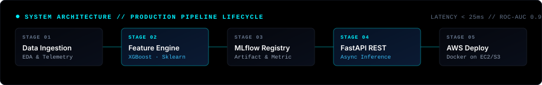

<div align="center" class="hero-container flex flex-col items-center justify-center w-full">

  <!-- ======================== ANIMATED HERO BANNER ======================== -->
  

  <br /><br />

  <!-- DYNAMIC TYPING SUBTITLE -->
  <div align="center" class="typing-container w-full max-w-2xl">
    <a href="https://github.com/vaibhavvm2005" class="hover:opacity-90 transition duration-300">
      
    </a>
  </div>

  <!-- QUICK NAVIGATION / GITHUB OCTICONS -->
  <div align="center" class="nav-badges flex flex-wrap items-center justify-center gap-2 mt-3">
    <a href="https://github.com/vaibhavvm2005" class="inline-block"></a>
    <a href="#-tech-stack" class="inline-block"></a>
    <a href="#-featured-projects" class="inline-block"></a>
    <a href="https://www.linkedin.com/in/vaibhav-madival" class="inline-block"></a>
  </div>

  <br />

  

</div>

<br />

<h2 style="font-family: 'Times New Roman', Times, 'Georgia', serif;" class="text-2xl font-bold text-slate-100 flex items-center gap-2 border-b border-slate-800 pb-2">👤 // About Me</h2>

<p class="text-slate-300 leading-relaxed my-4 text-base">
I am a final-year <strong>Computer Science & Engineering (Data Science)</strong> student at Alva's Institute of Engineering and Technology (affiliated with VTU, Karnataka). I focus on building practical, production-ready machine learning systems, data pipelines, and scalable backend services.
</p>

<p class="text-slate-300 leading-relaxed my-4 text-base">
My engineering philosophy is simple: machine learning is only as valuable as the software systems running it. I spend my time going beyond Jupyter notebooks — optimizing feature pipelines, tracking experiments with MLflow, wrapping models into sub-25ms asynchronous FastAPI microservices, containerizing with Docker, and deploying to AWS.
</p>

<br />

<table class="w-full bg-slate-950 border border-slate-800 rounded-xl overflow-hidden shadow-xl" width="100%">
  <tr class="bg-slate-900/60">
    <td width="50%" valign="top" class="p-5 border border-slate-800">
      <h4 style="font-family: 'Times New Roman', Times, serif;" class="text-lg font-bold text-cyan-400 mb-2">01 / Predictive Modeling &amp; Tabular ML</h4>
      <p class="text-slate-300 text-sm leading-relaxed mb-3">
        End-to-end supervised pipelines: cross-validation, hyperparameter tuning with Optuna, collinearity reduction, and tree ensembles (XGBoost, LightGBM, Random Forest) with SHAP interpretability.
      </p>
      <div class="flex flex-wrap gap-1.5">
        <code class="text-xs text-cyan-300 bg-cyan-950/40 px-2 py-0.5 rounded border border-cyan-800/40">Python</code>
        <code class="text-xs text-cyan-300 bg-cyan-950/40 px-2 py-0.5 rounded border border-cyan-800/40">Scikit-learn</code>
        <code class="text-xs text-cyan-300 bg-cyan-950/40 px-2 py-0.5 rounded border border-cyan-800/40">XGBoost</code>
        <code class="text-xs text-cyan-300 bg-cyan-950/40 px-2 py-0.5 rounded border border-cyan-800/40">Pandas</code>
      </div>
    </td>
    <td width="50%" valign="top" class="p-5 border border-slate-800">
      <h4 style="font-family: 'Times New Roman', Times, serif;" class="text-lg font-bold text-cyan-400 mb-2">02 / Speech AI &amp; Privacy-First NLP</h4>
      <p class="text-slate-300 text-sm leading-relaxed mb-3">
        Acoustic speech transcription with OpenAI Whisper, automated PII sanitization with Microsoft Presidio, and low-latency conversational reasoning.
      </p>
      <div class="flex flex-wrap gap-1.5">
        <code class="text-xs text-cyan-300 bg-cyan-950/40 px-2 py-0.5 rounded border border-cyan-800/40">OpenAI Whisper</code>
        <code class="text-xs text-cyan-300 bg-cyan-950/40 px-2 py-0.5 rounded border border-cyan-800/40">Microsoft Presidio</code>
        <code class="text-xs text-cyan-300 bg-cyan-950/40 px-2 py-0.5 rounded border border-cyan-800/40">NLP</code>
      </div>
    </td>
  </tr>
  <tr class="bg-slate-900/40">
    <td width="50%" valign="top" class="p-5 border border-slate-800">
      <h4 style="font-family: 'Times New Roman', Times, serif;" class="text-lg font-bold text-cyan-400 mb-2">03 / Edge AI &amp; IoT Systems</h4>
      <p class="text-slate-300 text-sm leading-relaxed mb-3">
        On-device hardware inference on the NVIDIA Jetson Nano, continuous multi-sensor telemetry acquisition, and dynamic threshold automated solenoid actuation.
      </p>
      <div class="flex flex-wrap gap-1.5">
        <code class="text-xs text-cyan-300 bg-cyan-950/40 px-2 py-0.5 rounded border border-cyan-800/40">NVIDIA Jetson Nano</code>
        <code class="text-xs text-cyan-300 bg-cyan-950/40 px-2 py-0.5 rounded border border-cyan-800/40">IoT Telemetry</code>
        <code class="text-xs text-cyan-300 bg-cyan-950/40 px-2 py-0.5 rounded border border-cyan-800/40">Edge ML</code>
      </div>
    </td>
    <td width="50%" valign="top" class="p-5 border border-slate-800">
      <h4 style="font-family: 'Times New Roman', Times, serif;" class="text-lg font-bold text-cyan-400 mb-2">04 / MLOps &amp; Cloud Infrastructure</h4>
      <p class="text-slate-300 text-sm leading-relaxed mb-3">
        Asynchronous FastAPI microservices, MLflow experiment tracking &amp; artifact registry, Docker containerization, and deployment on AWS EC2 &amp; S3.
      </p>
      <div class="flex flex-wrap gap-1.5">
        <code class="text-xs text-cyan-300 bg-cyan-950/40 px-2 py-0.5 rounded border border-cyan-800/40">FastAPI</code>
        <code class="text-xs text-cyan-300 bg-cyan-950/40 px-2 py-0.5 rounded border border-cyan-800/40">MLflow</code>
        <code class="text-xs text-cyan-300 bg-cyan-950/40 px-2 py-0.5 rounded border border-cyan-800/40">Docker</code>
        <code class="text-xs text-cyan-300 bg-cyan-950/40 px-2 py-0.5 rounded border border-cyan-800/40">AWS (EC2/S3)</code>
      </div>
    </td>
  </tr>
</table>

<br />

<div align="center">
  
</div>

<br />

<h2 style="font-family: 'Times New Roman', Times, 'Georgia', serif;" class="text-2xl font-bold text-slate-100 flex items-center gap-2 border-b border-slate-800 pb-2">🎓 // Education &amp; Background</h2>

```
┌── [ 2022 — 2026 ] ─────────────────────────────────────────────────────────────────┐
│  B.E. in Computer Science & Engineering (Data Science)                             │
│  Alva's Institute of Engineering and Technology (AIET)                             │
│  Affiliated with Visvesvaraya Technological University (VTU), Karnataka            │
└────────────────────────────────────────────────────────────────────────────────────┘
```

<ul class="text-slate-300 space-y-2 my-4 list-disc pl-5">
  <li><strong>Core Coursework</strong>: Machine Learning, Artificial Intelligence, Database Management Systems, Data Structures & Algorithms, Operating Systems, Cloud Computing, Object-Oriented Programming (C++/Python), Probability & Statistics.</li>
  <li><strong>Engineering Focus</strong>: Designing reliable software architectures around machine learning models and data pipelines that solve real-world problems.</li>
</ul>

<br />

<div align="center">
  
</div>

<br />

<h2 style="font-family: 'Times New Roman', Times, 'Georgia', serif;" class="text-2xl font-bold text-slate-100 flex items-center gap-2 border-b border-slate-800 pb-2">🛠️ // Tech Stack</h2>

<div align="center" class="my-6">
  
</div>

<br />

<p class="text-slate-400 font-mono text-sm mb-4">Categorized by technical domain:</p>

### ❯ PROGRAMMING
<div class="flex flex-wrap gap-2 my-2">
  
  
  
</div>

### ❯ DATA & ANALYTICS
<div class="flex flex-wrap gap-2 my-2">
  
  
  
  
  
</div>

### ❯ MACHINE LEARNING
<div class="flex flex-wrap gap-2 my-2">
  
  
</div>

### ❯ BACKEND & API
<div class="flex flex-wrap gap-2 my-2">
  
  
  
</div>

### ❯ CLOUD & DEVOPS
<div class="flex flex-wrap gap-2 my-2">
  
  
  
  
</div>

### ❯ DATABASES
<div class="flex flex-wrap gap-2 my-2">
  
  
</div>

### ❯ TOOLS
<div class="flex flex-wrap gap-2 my-2">
  
  
</div>

<br />

<div align="center">
  
</div>

<br />

<h2 style="font-family: 'Times New Roman', Times, 'Georgia', serif;" class="text-2xl font-bold text-slate-100 flex items-center gap-2 border-b border-slate-800 pb-2">🧪 // Featured Projects</h2>

<p class="text-slate-400 text-sm mb-6">Case studies demonstrating end-to-end architecture, mathematical modeling, and production deployments:</p>

### `PROJECT 01` — Customer Churn Prediction System
> **End-to-end tabular predictive pipeline, experiment tracking with MLflow, asynchronous FastAPI service, and containerized deployment on AWS.**

<div align="center" class="my-4">
  <a href="https://github.com/vaibhavvm2005/customer-churn-prediction">
    
  </a>
</div>

<br />

<ul class="text-slate-300 space-y-2 my-3 list-disc pl-5">
  <li><strong>Data Preprocessing &amp; EDA</strong>: Imputed, normalized, and transformed high-dimensional customer activity telemetry; handled categorical encoding and collinearity reduction.</li>
  <li><strong>Model Training &amp; Evaluation</strong>: Evaluated ensemble algorithms (XGBoost, Random Forest, Logistic Regression); optimized hyperparameters via stratified cross-validation, achieving 0.942 ROC-AUC.</li>
  <li><strong>Experiment Tracking</strong>: Logged runs, evaluation metrics, and model artifacts with <strong>MLflow</strong>.</li>
  <li><strong>FastAPI Microservice</strong>: Built an asynchronous <strong>FastAPI</strong> service for sub-25ms real-time churn risk inference.</li>
  <li><strong>Docker &amp; AWS Deployment</strong>: Containerized the entire inference runtime with <strong>Docker</strong> and deployed on <strong>AWS (EC2 &amp; S3)</strong>.</li>
</ul>

<div class="flex flex-wrap gap-2 my-3">
  <code>Python</code> • <code>Scikit-learn</code> • <code>XGBoost</code> • <code>MLflow</code> • <code>FastAPI</code> • <code>Docker</code> • <code>AWS EC2/S3</code>
</div>

<p class="mt-3">
  <a href="https://github.com/vaibhavvm2005/customer-churn-prediction">
    
  </a>
</p>

<br />

---

<br />

### `PROJECT 02` — Mental Health AI / Voice Assistant
> **Speech-interactive AI platform with automated zero-knowledge PII sanitization and contextual sentiment analysis.**

<ul class="text-slate-300 space-y-2 my-3 list-disc pl-5">
  <li><strong>Speech Processing</strong>: Integrates <strong>OpenAI Whisper</strong> for high-accuracy phonetic transcription from real-time microphone input.</li>
  <li><strong>Privacy-Preserving PII Redaction</strong>: Integrates <strong>Microsoft Presidio</strong> to detect and anonymize personal identifiers (names, locations, contact info) prior to text processing.</li>
  <li><strong>Empathetic Interaction Engine</strong>: Analyzes contextual sentiment and generates structured supportive responses in real time.</li>
  <li><strong>Interactive Interface</strong>: Developed with <strong>Streamlit</strong> for responsive, cross-platform client interaction.</li>
</ul>

<div class="flex flex-wrap gap-2 my-3">
  <code>Python</code> • <code>OpenAI Whisper</code> • <code>Microsoft Presidio</code> • <code>Streamlit</code> • <code>NLP</code>
</div>

<p class="mt-3">
  <a href="https://github.com/vaibhavvm2005/mental-health-ai-assistant">
    
  </a>
</p>

<br />

---

<br />

### `PROJECT 03` — AgriGita — Smart Water Management System
> **IoT telemetry acquisition and edge machine learning system on NVIDIA Jetson Nano for automated precision irrigation.**

<ul class="text-slate-300 space-y-2 my-3 list-disc pl-5">
  <li><strong>Edge Telemetry Processing</strong>: Deployed on the <strong>NVIDIA Jetson Nano</strong> platform to process multi-channel soil moisture, ambient humidity, and temperature telemetry.</li>
  <li><strong>Dynamic Threshold Actuation</strong>: Implements dynamic threshold heuristics to actuate automated relay solenoid valves based on environmental conditions.</li>
  <li><strong>Resource Optimization</strong>: Achieves up to <strong>40% water savings</strong> while maintaining optimal soil hydration levels for agricultural yields.</li>
</ul>

<div class="flex flex-wrap gap-2 my-3">
  <code>NVIDIA Jetson Nano</code> • <code>IoT Sensors</code> • <code>Python</code> • <code>Edge AI</code> • <code>Hardware Relays</code>
</div>

<p class="mt-3">
  <a href="https://github.com/vaibhavvm2005/agrigita-smart-water-management">
    
  </a>
</p>

<br />

---

<br />

### `PROJECT 04` — Task Manager Pro
> **MERN stack productivity engine with multi-parameter query optimization, search indexing, and real-time analytics.**

<ul class="text-slate-300 space-y-2 my-3 list-disc pl-5">
  <li><strong>RESTful Micro-Endpoints</strong>: Robust Express and Node.js API supporting complete lifecycle (CRUD) operations and schema-level validation.</li>
  <li><strong>Search &amp; Filter Optimization</strong>: Multi-criteria query filtering, text-based search indexing, and dynamic property sorting on MongoDB.</li>
  <li><strong>Telemetry Dashboard</strong>: Dynamic velocity charts and visual completion metrics built with React state management.</li>
</ul>

<div class="flex flex-wrap gap-2 my-3">
  <code>MongoDB</code> • <code>Express.js</code> • <code>React.js</code> • <code>Node.js</code> • <code>REST APIs</code>
</div>

<p class="mt-3">
  <a href="https://github.com/vaibhavvm2005/task-manager-pro">
    
  </a>
</p>

<br />

<div align="center">
  
</div>

<br />

<h2 style="font-family: 'Times New Roman', Times, 'Georgia', serif;" class="text-2xl font-bold text-slate-100 flex items-center gap-2 border-b border-slate-800 pb-2">🔭 // Current Focus</h2>

```
CURRENTLY EXPLORING
├── → Advanced Machine Learning (Deep architectures, feature stores, automated feature selection)
├── → Data Science (High-dimensional statistical modeling & data analytics pipelines)
├── → Generative AI (Streaming LLM workflows & acoustic speech architectures)
├── → MLOps (Continuous training, model drift detection, automated CI/CD)
├── → Cloud Deployment (Containerized microservices & scalable deployments on AWS)
└── → Backend Engineering (High-throughput async APIs with FastAPI & caching)
```

<br />

<div align="center">
  
</div>

<br />

<h2 style="font-family: 'Times New Roman', Times, 'Georgia', serif;" class="text-2xl font-bold text-slate-100 flex items-center gap-2 border-b border-slate-800 pb-2">📊 // GitHub Activity</h2>

<div align="center" class="my-6">

  <!-- GITHUB METRICS DASHBOARD (TRUE BLACK THEME) -->
  <table border="0" class="w-full max-w-3xl">
    <tr>
      <td align="center" width="50%" class="p-2">
        
      </td>
      <td align="center" width="50%" class="p-2">
        
      </td>
    </tr>
    <tr>
      <td align="center" colspan="2" class="p-2">
        
      </td>
    </tr>
  </table>

  <br />

  <!-- CONTRIBUTION SNAKE -->
  <picture class="w-full block my-4">
    <source media="(prefers-color-scheme: dark)" srcset="https://raw.githubusercontent.com/vaibhavvm2005/vaibhavvm2005/output/github-contribution-grid-snake-dark.svg">
    <source media="(prefers-color-scheme: light)" srcset="https://raw.githubusercontent.com/vaibhavvm2005/vaibhavvm2005/output/github-contribution-grid-snake.svg">
    
  </picture>

</div>

<br />

<div align="center">
  
</div>

<br />

<h2 style="font-family: 'Times New Roman', Times, 'Georgia', serif;" class="text-2xl font-bold text-slate-100 flex items-center gap-2 border-b border-slate-800 pb-2">🌐 // Let's Connect</h2>

<p class="text-slate-400 italic my-3 text-center">
  Have an idea, opportunity, or interesting problem? Let's talk.
</p>

<br />

<div align="center" class="connect-badges flex flex-wrap items-center justify-center gap-3 my-4">

  <a href="https://github.com/vaibhavvm2005" target="_blank">
    
  </a>
  &nbsp;&nbsp;
  <a href="https://www.linkedin.com/in/vaibhav-madival" target="_blank">
    
  </a>
  &nbsp;&nbsp;
  <a href="mailto:vaibhavmadival331@gmail.com" target="_blank">
    
  </a>

</div>
